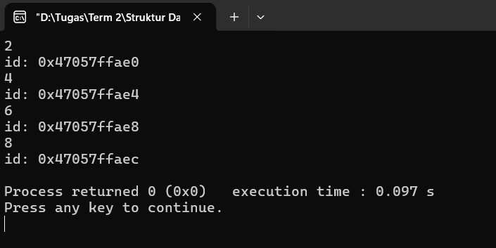
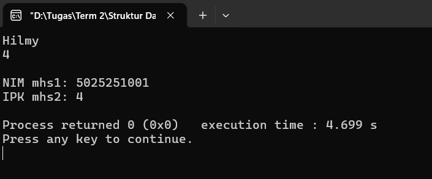
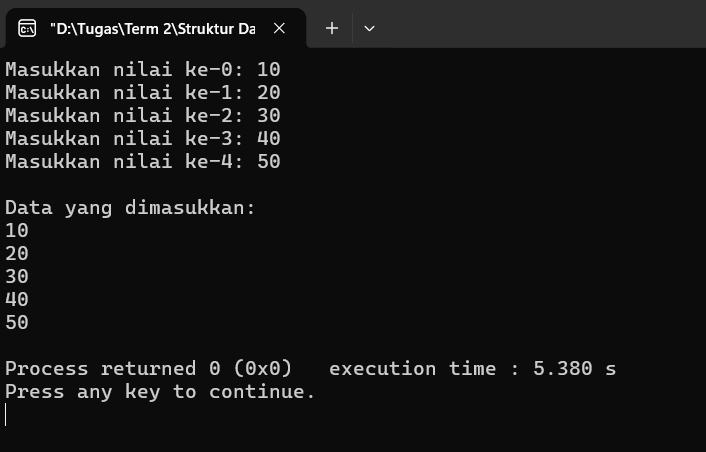
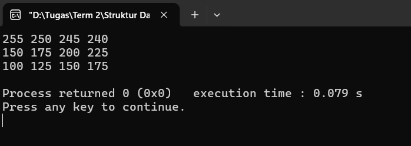
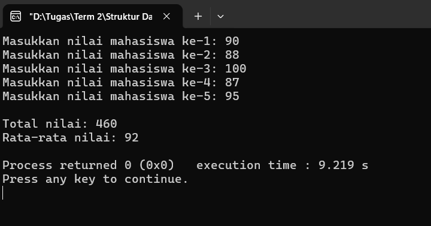
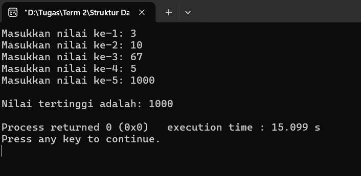
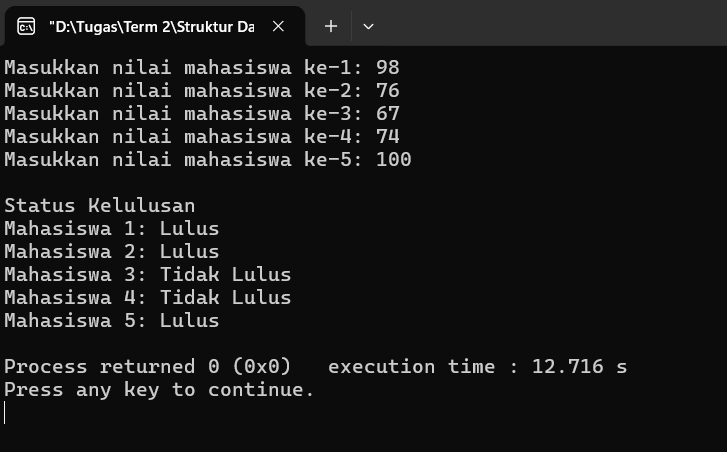
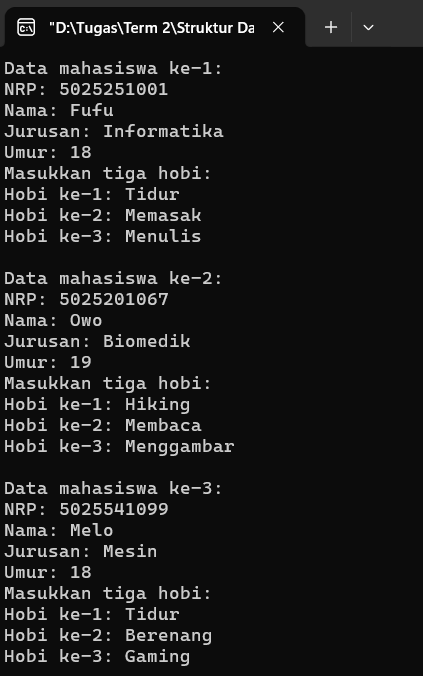
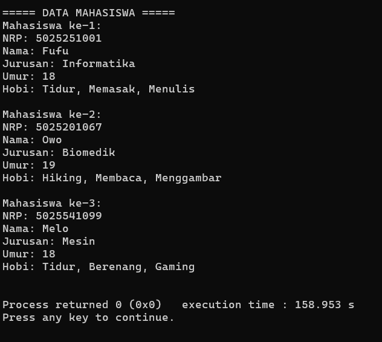

# *Array of Data* di C++

## Deklarasi Array
Array dapat dideklarasikan menggunakan ```[]``` (kurung siku), dan data-data di dalam array tersebut dapat di-*input* di dalam ```{}``` (kurung kurawal) dan dipisahkan menggunakan koma. Selanjutnya, data-data tersebut dapat dikeluarkan satu per satu menggunakan *for loop*. Selain itu, untuk mengakses alamat dari setiap data yang ada di dalam array, maka dapat ditambahkan ```&``` (*operator address-of*) sebelum variabel.

**Kode**:
```cpp
#include <bits/stdc++.h>
using namespace std;

int main() {
    int arr[] = {2, 4, 6, 8};

    for(int i = 0; i < 4; i++) {
        cout << arr[i] << endl;
        cout << "id: " << &arr[i] << endl;
    }

    return 0;
}
```

**Output**:




## Deklarasi Record
Record dapat dideklarasikan sebelum fungsi ```main``` menggunakan ```struct```, lalu diikuti nama dari ```struct``` tersebut. Lalu, di dalam ```{}``` dapat ditambahkan berbagai variabel dengan tipe data yang berbeda sesuai dengan kebutuhan pengguna. Lalu, agar ```struct``` tersebut dapat diakses, maka pengguna perlu membuat sebuah variabel bertipe data ```struct``` tersebut (yang di mana pada kasus ini, variabel ```mhs1``` dan ```mhs2``` bertipe data ```mahasiswa```). Selanjutnya, pengguna dapat memasukkan maupun mengeluarkan data dengan cara mengetikkan nama variabel, diikuti titik dan variabel yang ada di dalam ```struct``` tersebut (contoh: ```mhs1.nama```, ```mhs2.nim```).

**Kode**:
```cpp
#include <bits/stdc++.h>
using namespace std;

struct mahasiswa {
    string nim, nama, prodi;
    float ipk;
};

int main() {
    mahasiswa mhs1, mhs2;

    mhs1.nim = "5025251001";
    cin >> mhs1.nama;

    mhs2.nim = "5025251010";
    cin >> mhs2.ipk;

    cout << endl;
    cout << "NIM mhs1: " << mhs1.nim << endl;
    cout << "IPK mhs2: " << mhs2.ipk << endl;

    return 0;
}
```
**Output**:



## Input Array
Pengguna dapat baik memasukkan maupun mengeluarkan data-data yang ada di array menggunakan *for loop*. Proses ini dilakukan secara bertahap dan berulang, menyesuaikan besar nilai dari array tersebut.

**Kode**:
```cpp
#include <bits/stdc++.h>
using namespace std;

int main() {
    int nilai[5];

    for(int i = 0; i < 5; i++) {
        cout << "Masukkan nilai ke-" << i << ": ";
        cin >> nilai[i];
    }

    cout << endl;
    cout << "Data yang dimasukkan: " << endl;

    for(int i = 0; i < 5; i++) cout << nilai[i] << endl;

    return 0;
}
```

**Output**:



## Akses Elemen Array (2D)
Pengguna dapat mengakses elemen array dua dimensi menggunakan dua ```[]```. Metode ini dapat digambarkan seperti sebuah matriks, yang di mana ```[]``` pertama berfungsi sebagai baris, dan ```[]``` kedua berfungsi sebagai kolom dari matriks tersebut. Lalu, baik untuk meng-*input* maupun mengakses semua data yang ada di dalam array, pengguna dapat menggunakan *nested loop*. Jumlah perulangan di *loop* terluar dapat disesuaikan dengan nilai dari baris matriks (```[]``` pertama), sedangkan jumlah perulangan di *loop* yang berada di dalam dapat disesuaikan dengan nilai kolom matriks tersebut (```[]``` kedua) (atau jika tidak, bisa juga disesuaikan dengan kebutuhan pengguna).

**Kode**:
```cpp
#include <bits/stdc++.h>
using namespace std;

int main() {
    int matrix[3][4] = {{255, 250, 245, 240}, {150, 175, 200, 225}, {100, 125, 150, 175}};

    for(int i = 0; i < 3; i++) {
        for(int j = 0; j < 4; j++) {
            cout << matrix[i][j] << " ";
        }

        cout << endl;
    }

    return 0;
}
```

**Output**:



## Menghitung Rata-rata
Pengguna dapat menghitung rata-rata dengan menggunakan *for loop*, tepatnya untuk mencari total nilai dari semua data yang di-*input* yang akan disimpan di sebuah variabel (yang dalam kasus ini disimpan di dalam variabel ```total```). Setelahnya, total nilai tersebut dibagi dengan jumlah data yang dimasukkan (yang di dalam kasus ini, disesuaikan dengan besar nilai array). Terakhir, nilai rata-rata tersebut dapat disimpan di sebuah variabel dengan tipe data ```float``` atau ```double```, agar mendapatkan nilai yang lebih akurat.

**Kode**:
```cpp
#include <bits/stdc++.h>
using namespace std;

int main() {
    int nilai[5], total = 0;
    float rerata;

    for(int i = 0; i < 5; i++) {
        cout << "Masukkan nilai mahasiswa ke-" << i + 1 << ": ";
        cin >> nilai[i];

        total += nilai[i];
    }

    rerata = total / 5.0;

    cout << endl;
    cout << "Total nilai: " << total << endl;
    cout << "Rata-rata nilai: " << rerata << endl;

    return 0;
}
```

**Output**:



## Mencari Nilai Maksimal
Pengguna dapat mencari nilai maksimal suatu array menggunakan *for loop*, yang di mana nilai-nilai yang berada di dalam array tersebut akan dibandingkan satu per satu untuk menentukan nilai yang paling besar. Untuk mencari nilai maksimal, pengguna perlu membuat variabel baru yang nantinya akan digunakan menyimpan nilai yang lebih besar. Pembandingan nilai tersebut dilakukan menggunakan percabangan *if-else*, yang di mana apabila nilai ke-i dari array tersebut lebih besar dari pada nilai variabel buatan pengguna, maka variabel buatan tersebut akan menyimpan nilai ke-i dari array tersebut.

**Kode**:
```cpp
#include <bits/stdc++.h>
using namespace std;

int main() {
    int nilai[5], maximum;

    for(int i = 0; i < 5; i++) {
        cout << "Masukkan nilai ke-" << i + 1 << ": ";
        cin >> nilai[i];
    }

    maximum = nilai[0];

    for(int i = 1; i < 5; i++) {
        if(nilai[i] > maximum) maximum = nilai[i];
    }

    cout << endl;
    cout << "Nilai tertinggi adalah: " << maximum << endl;

    return 0;
}
```

**Output**:



## Menentukan Kelulusan (*If-Else*)
Dengan menggunakan percabangan (*if-else*), program ini dapat menentukan status kelulusan mahasiswa melalui nilai-nilai yang di-*input* oleh pengguna. Nilai-nilai tersebut akan di-*input* dan disimpan di dalam sebuah array. Setelahnya, secara satu per satu (menggunakan *for loop*), nilai-nilai yang ada di dalam array akan dibandingkan dengan nilai minimum untuk lulus (yang dalam kasus ini nilai minimumnya adalah 75). Apabila nilai mahasiswa tersebut >= 75, maka mahasiswa tersebut dinyatakan lulus, dan begitu pula sebaliknya.

**Kode**:
```cpp
#include <bits/stdc++.h>
using namespace std;

int main() {
    int nilai[5];

    for(int i = 0; i < 5; i++) {
        cout << "Masukkan nilai mahasiswa ke-" << i + 1 << ": ";
        cin >> nilai[i];
    }

    cout << endl;
    cout << "Status Kelulusan" << endl;

    for(int i = 0; i < 5; i++) {
        if(nilai[i] >= 75) cout << "Mahasiswa " << i + 1 << ": Lulus" << endl;
        else cout << "Mahasiswa " << i + 1 << ": Tidak Lulus" << endl;
    }

    return 0;
}
```

**Output**:



## Record Mahasiswa
Program ini memanfaatkan ```struct``` untuk menyimpan data-data mengenai mahasiswa dengan tipe data yang berbeda. Sama seperti sebelumnya, pengguna perlu membuat variabel bertipe data ```struct``` (yang dalam kasus ini berarti bertipe data ```mahasiswa```) agar dapat mengakses ```struct``` tersebut. Selanjutnya, pengguna dapat menggunakan *nested loop* untuk meng-*input* data ke dalam array.

**Kode**:
```cpp
#include <bits/stdc++.h>
using namespace std;

struct mahasiswa {
    int umur;
    string nrp, nama, jurusan, hobi[3];
};

int main() {
    mahasiswa mhs[3];

    for(int i = 0; i < 3; i++) {
        cout << "Data mahasiswa ke-" << i + 1 << ": " << endl;

        cout << "NRP: ";
        cin >> mhs[i].nrp;

        cout << "Nama: ";
        cin >> mhs[i].nama;

        cout << "Jurusan: ";
        cin >> mhs[i].jurusan;

        cout << "Umur: ";
        cin >> mhs[i].umur;

        cout << "Masukkan tiga hobi: " << endl;
        for(int j = 0; j < 3; j++) {
            cout << "Hobi ke-" << j + 1 << ": ";
            cin >> mhs[i].hobi[j];
        }

        cout << endl;
    }

    cout << endl;
    cout << "===== DATA MAHASISWA =====" << endl;

    for(int i = 0; i < 3; i++) {
        cout << "Mahasiswa ke-" << i + 1 << ": " <<endl;
        cout << "NRP: " << mhs[i].nrp << endl;
        cout << "Nama: " << mhs[i].nama << endl;
        cout << "Jurusan: " << mhs[i].jurusan << endl;
        cout << "Umur: " << mhs[i].umur << endl;

        cout << "Hobi: ";
        for(int j = 0; j < 3; j++) {
            cout << mhs[i].hobi[j];

            if(j < 2) cout << ", ";
        }

        cout << endl << endl;
    }

    return 0;
}
```

**Output**:




