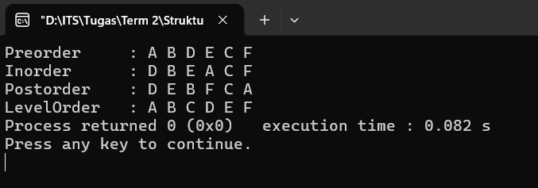

# Tree

**Full Code**:
```cpp
#include <bits/stdc++.h>
using namespace std;

struct Node {
    char data;
    Node* left;
    Node* right;

    Node(char val) {
    data = val;
    left = right = NULL;
    }
};

void preorder(Node* root) {
    if (root == NULL) return;

    cout << root->data << " ";
    preorder(root->left);
    preorder(root->right);
}

void inorder(Node* root) {
    if (root == NULL) return;

    inorder(root->left);
    cout << root->data << " ";
    inorder(root->right);
}

void postorder(Node* root) {
    if (root == NULL) return;

    postorder(root->left);
    postorder(root->right);
    cout << root->data << " ";
}

void levelOrder(Node* root) {
    if (root == NULL) return;

    queue<Node*> q;
    q.push(root);

    while (!q.empty()) {
        Node* current = q.front();
        q.pop();

        cout << current->data << " ";

        if (current->left != NULL) q.push(current->left);

        if (current->right != NULL) q.push(current->right);
    }
}

int main() {
    Node* root = new Node('A');
    root->left = new Node('B');
    root->right = new Node('C');
    root->left->left = new Node('D');
    root->left->right = new Node('E');
    root->right->right = new Node('F');

    cout << "Preorder     : ";
    preorder(root);

    cout << "\nInorder      : ";
    inorder(root);

    cout << "\nPostorder    : ";
    postorder(root);

    cout << "\nLevelOrder   : ";
    levelOrder(root);

    return 0;
}
```

### Penjelasan Kode
#### 1. `struct Node`
Digunakan untuk mendefinisikan struktur satu _node_ dalam _tree_. Pada _struct_ tersebut, variabel `data` digunakan untuk menyimpan karakter, lalu variabel `left` dan `right` digunakan sebagai _pointer_ ke _node_ anak kiri dan kanan (awalnya `NULL`).

#### 2. `void preorder(Node* root)`
Digunakan untuk mencetak isi _tree_ dengan urutan _preorder_ (_root_ > kiri > kanan). Algoritma fungsi tersebut dapat dijelaskan sebagai berikut:
1. Jika _node_ `NULL`, maka berhenti (_base case_)
2. Cetak data _node_ saat ini (_root_)
3. Panggil fungsi ke anak kiri (rekursif)
4. Panggil fungsi anak kanan (rekursif)

#### 3. `void inorder(Node* root)`
Digunakan untuk mencetak isi _tree_ dengan urutan _inorder_ (kiri > _root_ > kanan). Algoritma fungsi tersebut dapat dijelaskan sebagai berikut:
1. Jika _node_ `NULL`, maka berhenti (_base case_)
2. Panggil fungsi ke anak kiri (rekursif)
3. Cetak data _node_ saat ini (_root_)
4. Panggil fungsi anak kanan (rekursif)

#### 4. `void postorder(Node* root)`
Digunakan untuk mencetak isi _tree_ dengan urutan _postorder_ (kiri > kanan > _root_). Algoritma fungsi tersebut dapat dijelaskan sebagai berikut:
1. Jika _node_ `NULL`, maka berhenti (_base case_)
2. Panggil fungsi ke anak kiri (rekursif)
3. Panggil fungsi anak kanan (rekursif)
4. Cetak data _node_ saat ini (_root_)

#### 5. `void levelOrder(Node* root)`
Digunakan untuk mencetak isi _tree_ _level_ per _level_. Algoritma fungsi tersebut dapat dijelaskan sebagai berikut:
1. Jika _node_ `NULL`, maka berhenti (_base case_)
2. Buat _queue_ dan masukkan _root_ ke _queue_
3. Selama antrean tidak kosong:
  - Ambil _node_ di depan antrean (_current_)
  - Hapus _node_ dari antrean
  - Jika ada anak kiri, masukkan ke antrean
  - Jika ada anak kanan, masukkan ke antrean
4. Ulangi langkah 3 hingga antrean kosong

**Output**:


