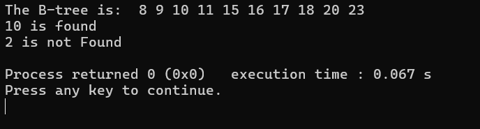

# B-Tree & BST

## B-Tree
**Full Code**:
```cpp
#include <bits/stdc++.h>
using namespace std;

class TreeNode {
    int *keys, t, n;
    bool leaf;
    TreeNode **C;

public:
    TreeNode(int temp, bool bool_leaf);

    void insertNonFull(int k);
    void splitChild(int i, TreeNode *y);
    void traverse();

    TreeNode *search(int k);

    friend class BTree;
};

class BTree {
    TreeNode *root;
    int t;

public:
    BTree(int temp) {
        root = NULL;
        t = temp;
    }

    void traverse() {
        if (root != NULL)
        root->traverse();
    }

    TreeNode *search(int k) {
        return (root == NULL) ? NULL : root->search(k);
    }

    void insert(int k);
};

TreeNode::TreeNode(int t1, bool leaf1) {
    t = t1;
    leaf = leaf1;

    keys = new int[2 * t - 1];
    C = new TreeNode *[2 * t];

    n = 0;
}

void TreeNode::traverse() {
    int i;
    for(i = 0; i < n; i++) {
        if (leaf == false) C[i]->traverse();
        cout << " " << keys[i];
    }

    if(leaf == false) C[i]->traverse();
}

TreeNode *TreeNode::search(int k) {
    int i = 0;
    while (i < n && k > keys[i]) i++;

    if(keys[i] == k)
        return this;

    if (leaf == true)
        return NULL;

    return C[i]->search(k);
}

void BTree::insert(int k) {
    if (root == NULL) {
        root = new TreeNode(t, true);
        root->keys[0] = k;
        root->n = 1;
    }
    else {
        if (root->n == 2 * t - 1) {
            TreeNode *s = new TreeNode(t, false);

            s->C[0] = root;
            s->splitChild(0, root);

            int i = 0;
            if (s->keys[0] < k) i++;

            s->C[i]->insertNonFull(k);
            root = s;
        }
        else root->insertNonFull(k);
  }
}

void TreeNode::insertNonFull(int k) {
    int i = n - 1;

    if (leaf == true) {

        while (i >= 0 && keys[i] > k) {
            keys[i + 1] = keys[i];
            i--;
        }

        keys[i + 1] = k;
        n = n + 1;
    }
    else {
        while (i >= 0 && keys[i] > k) i--;

        if (C[i + 1]->n == 2 * t - 1) {
            splitChild(i + 1, C[i + 1]);

            if (keys[i + 1] < k) i++;
        }

        C[i + 1]->insertNonFull(k);
    }
}

void TreeNode::splitChild(int i, TreeNode *y) {
    TreeNode *z = new TreeNode(y->t, y->leaf);
    z->n = t - 1;

    for (int j = 0; j < t - 1; j++) z->keys[j] = y->keys[j + t];

    if (y->leaf == false) {
        for (int j = 0; j < t; j++) z->C[j] = y->C[j + t];
    }

    y->n = t - 1;
    for (int j = n; j >= i + 1; j--) C[j + 1] = C[j];

    C[i + 1] = z;

    for (int j = n - 1; j >= i; j--) keys[j + 1] = keys[j];

    keys[i] = y->keys[t - 1];
    n = n + 1;
}

int main() {
    BTree t(3);
    t.insert(8);
    t.insert(9);
    t.insert(10);
    t.insert(11);
    t.insert(15);
    t.insert(16);
    t.insert(17);
    t.insert(18);
    t.insert(20);
    t.insert(23);

    cout << "The B-tree is: ";
    t.traverse();

    int k = 10;
    (t.search(k) != NULL) ? cout << endl
                 << k << " is found"
              : cout << endl
                 << k << " is not Found";

    k = 2;
    (t.search(k) != NULL) ? cout << endl
                 << k << " is found"
              : cout << endl
                 << k << " is not Found\n";

    return 0;
}
```

### Penjelasan Kode
#### 1. `class TreeNode`
Pada bagian `class TreeNode`, terdiri dari variabel yang dibutuhkan agar B-Tree dapat diimplementasikan dengan baik. Variabel-variabel tersebut seperti: `*keys` yang digunakan untuk menyimpan nilai, lalu `t` untuk derajat minimum B-Tree, `n` untuk jumlah nilai atau kunci saat ini dalam _node_, `leaf` untuk _boolean_ apakah _node_ saat ini adalah daun, dan `**C` untuk _array pointer_ ke _child node_.

#### 2. `class BTree`
Pada bagian ini, terdapat dua variabel utama, yakni: `root` yang digunakan sebagai _pointer_ ke _node_ akar dan `t` yang digunakan sebagai derajat minimum B-Tree.

#### 3. `TreeNode *TreeNode::search(int k)`
Fungsi tersebut digunakan untuk proses penyisipan (_insert_), dengan prosesnya sebagai berikut:
1. Jika akar kosong, maka akan dibuat _node_ baru dengan satu kunci
2. Jika akar penuh (`n` = 2(`t`) - 1), maka akan dibuat _node_ akar baru, lalu pecah akar lama, dan akan ditentukan _child_ mana yang akan menerima kunci baru
3. Jika akar tidak penuh, maka akan dipanggil fungsi `insertNonFull`

#### 4. `void TreeNode::insertNonFull(int k)`
Fungsi ini digunakan untuk proses penyisipan saat B-Tree masih belum penuh, dengan prosesnya sebagai berikut:
1. Jika _node_ daun: sisipkan kunci ke posisi yang tepat dalam array
2. Jika _node_ internal: cari _child_ yang tepat, lalu pecah terlebih dahulu (jika _child_ penuh), dan rekursif ke _child_ yang sesuai

#### 5. `void TreeNode::splitChild(int i, TreeNode *y)`
Fungsi ini digunakan untuk memecah _node_ `y` pada indeks ke-`i`, dengan prosesnya sebagai berikut:
1. Buat _node_ baru `z` (_node_ ini akan menjadi _sibling_ kanan)
2. Pindahkan `t - 1` kunci terbesar dari `y` ke `z`
3. Pindahkan _child_ (jika ada) dari `y` ke `z`
4. Sisipkan `z` sebagai _child_ baru setelah `y`
5. Naikkan kunci median (`y->keys[t - 1]`) ke _parent_

#### 6. `void TreeNode::traverse()`
Fungsi tersebut digunakan untuk menampilkan semua kunci secara _inorder_ (terurut).

#### 7. `TreeNode *TreeNode::search(int k)`
Fungsi tersebut digunakan untuk mencari kunci yang ditargetkan (memiliki tingkat kompleksitas O(log n)).

**Output**:


## BST
**Full Code**:
```cpp
#include <bits/stdc++.h>
using namespace std;

struct Node {
    int data;
    Node* left;
    Node* right;
};

Node* createNode(int value) {
    Node* newNode = new Node();
    newNode->data = value;
    newNode->left = NULL;
    newNode->right = NULL;

    return newNode;
}

Node* insert(Node* root, int value) {

    if (root == NULL) {
        return createNode(value);
    }

    if (value < root->data) {
        root->left = insert(root->left, value);
    }
    else if (value > root->data) {
        root->right = insert(root->right, value);
    }

    return root;
}

void inorder(Node* root) {
    if (root != NULL) {
        inorder(root->left);
        cout << root->data << " ";
        inorder(root->right);
    }
}

bool search(Node* root, int key) {
    if (root == NULL)
        return false;

    if (root->data == key)
        return true;

    if (key < root->data)
        return search(root->left, key);
    else
        return search(root->right, key);
}

int main() {
    Node* root = NULL;
    root = insert(root, 50);
    insert(root, 30);
    insert(root, 70);
    insert(root, 20);
    insert(root, 40);
    insert(root, 60);
    insert(root, 80);

    cout << "Inorder Traversal: ";
    inorder(root);
    cout << endl;

    int key = 60;
    if (search(root, key)) cout << "Data ditemukan" << " (" << key << ")" << endl;
    else cout << "Data tidak ditemukan" << endl;

    return 0;
}
```

### Penjelasan Kode
#### 1.

**Output**:


