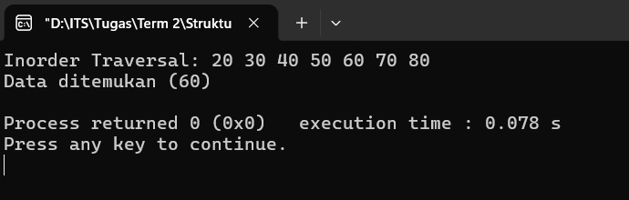
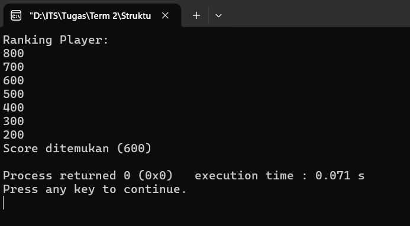

# Binary Search Tree

## BST
**Full Code**:
```cpp
#include <bits/stdc++.h>
using namespace std;

struct Node {
    int data;
    Node* left;
    Node* right;
};

Node* createNode(int value) {
    Node* newNode = new Node();
    newNode->data = value;
    newNode->left = NULL;
    newNode->right = NULL;

    return newNode;
}

Node* insert(Node* root, int value) {

    if (root == NULL) {
        return createNode(value);
    }

    if (value < root->data) {
        root->left = insert(root->left, value);
    }
    else if (value > root->data) {
        root->right = insert(root->right, value);
    }

    return root;
}

void inorder(Node* root) {
    if (root != NULL) {
        inorder(root->left);
        cout << root->data << " ";
        inorder(root->right);
    }
}

bool search(Node* root, int key) {
    if (root == NULL)
        return false;

    if (root->data == key)
        return true;

    if (key < root->data)
        return search(root->left, key);
    else
        return search(root->right, key);
}

int main() {
    Node* root = NULL;
    root = insert(root, 50);
    insert(root, 30);
    insert(root, 70);
    insert(root, 20);
    insert(root, 40);
    insert(root, 60);
    insert(root, 80);

    cout << "Inorder Traversal: ";
    inorder(root);
    cout << endl;

    int key = 60;
    if (search(root, key)) cout << "Data ditemukan" << " (" << key << ")" << endl;
    else cout << "Data tidak ditemukan" << endl;

    return 0;
}
```

### Penjelasan Kode
#### 1. `struct Node`
Pada bagian ini, terdapat beberapa variabel utama yang digunakan untuk membentuk sebuah _node_, yakni: `data` untuk menyimpan sebuah nilai, lalu `left` yang merupakan _pointer_ ke anak kiri (nilai lebih kecil) dan `right` yang merupakan _pointer_ ke anak kanan (nilai lebih besar).

#### 2. `Node* createNode(int value)`
Fungsi tersebut digunakan untuk membuat _node_ baru menggunakan fungsi `new`. Lalu, _node_ yang beru tersebut (`newNode`) akan diisi dengan nilai tertentu (diambil dari parameter `value`). Lalu, untuk `left` dan `right` akan di-_set_ `NULL` (masih belum punya anak).

#### 3. `Node* insert(Node* root, int value)`
Fungsi ini digunakan untuk melakukan penyisipan. Jika _tree_ kosong, maka fungsi `createNode` akan dipanggil untuk membuat _node_ baru. Namun, jika masih ada maka akan dilakukan penyisipan dengan kondisi sebagai berikut:
1. Jika `value` < `root->data`, maka _insert_ ke kiri
2. Jika `value` > `root->data`, maka _insert_ ke kanan
3. Jika `value` = `root->data`, tidak akan terjadi apa-apa (karena tidak ada duplikat)

#### 4. `void inorder(Node* root)`
Fungsi ini digunakan untuk mendapatkan hasil data secara terurut (_ascending_), dengan urutan penelusuran: kiri > _root_ > kanan.

#### 5. `bool search(Node* root, int key)`
Fungsi ini digunakan untuk melakukan pencarian dari nilai yang ditargetkan (`key`). Dengan metode pencarian yang dilakukan sebagai berikut:
1. Jika `root->data` = `NULL`, maka _return false_
2. Jika `root->data` = `key`, maka _return true_
3. Jika `root->data` > `key`, maka pencarian akan dilanjutkan ke kiri
4. Jika `root->data` < `key`, maka pencarian akan dilanjutkan ke kanan

**Output**:



## Studi Kasus: _Online Game_
**Full Code**:
```cpp
#include <bits/stdc++.h>
using namespace std;

struct Node {
    int score;
    Node* left;
    Node* right;
};

Node* createNode(int score) {
    Node* newNode = new Node();
    newNode->score = score;
    newNode->left = NULL;
    newNode->right = NULL;

    return newNode;
}

Node* insert(Node* root, int score) {
    if (root == NULL) {
        return createNode(score);
    }

    if (score < root->score) root->left = insert(root->left, score);
    else if (score > root->score) root->right = insert(root->right, score);

    return root;
}

void descending(Node* root) {
    if (root != NULL) {
        descending(root->right);
        cout << root->score << endl;
        descending(root->left);
    }
}

bool search(Node* root, int score) {
    if (root == NULL)
        return false;

    if (root->score == score)
        return true;

    if (score < root->score)
        return search(root->left, score);
    else
        return search(root->right, score);
}

int main() {
    Node* root = NULL;

    root = insert(root, 500);
    insert(root, 300);
    insert(root, 700);
    insert(root, 200);
    insert(root, 400);
    insert(root, 600);
    insert(root, 800);

    cout << "Ranking Player:" << endl;
    descending(root);

    int findScore = 600;
    if (search(root, findScore)) cout << "Score ditemukan" << " (" << findScore << ")"<< endl;
    else cout << "Score tidak ditemukan" << endl;

    return 0;
}
```

### Penjelasan Kode
Pada studi kasus kali ini, BST digunakan untuk menyelesaikan masalah pada kasus tersebut. Untuk implementasinya sendiri, ia tidak jauh berbeda dari struktur dasar BST yang telah dijelaskan sebelumnya.

#### 1. `struct Node`
Pada bagian ini, terdapat beberapa variabel utama yang digunakan untuk membentuk sebuah _node_, yakni: `score` untuk menyimpan sebuah nilai, lalu `left` yang merupakan _pointer_ ke anak kiri (nilai lebih kecil) dan `right` yang merupakan _pointer_ ke anak kanan (nilai lebih besar).

#### 2. `Node* createNode(int score)`
Fungsi tersebut digunakan untuk membuat _node_ baru menggunakan fungsi `new`. Lalu, _node_ yang beru tersebut (`newNode`) akan diisi dengan nilai tertentu (diambil dari parameter `score`). Lalu, untuk `left` dan `right` akan di-_set_ `NULL` (masih belum punya anak).

#### 3. `Node* insert(Node* root, int score)`
Fungsi ini digunakan untuk melakukan penyisipan. Jika _tree_ kosong, maka fungsi `createNode` akan dipanggil untuk membuat _node_ baru. Namun, jika masih ada maka akan dilakukan penyisipan dengan kondisi sebagai berikut:
1. Jika `value` < `root->score`, maka _insert_ ke kiri
2. Jika `value` > `root->score`, maka _insert_ ke kanan
3. Jika `value` = `root->score`, tidak akan terjadi apa-apa (karena tidak ada duplikat)

#### 4. `void descending(Node* root)`
Fungsi ini digunakan untuk mendapatkan hasil `score` secara terurut (_descending_), dengan urutan penelusuran: kanan > _root_ > kiri.

#### 5. `bool search(Node* root, int score)`
Fungsi ini digunakan untuk melakukan pencarian dari nilai yang ditargetkan (`score`). Dengan metode pencarian yang dilakukan sebagai berikut:
1. Jika `root->score` = `NULL`, maka _return false_
2. Jika `root->score` = `score`, maka _return true_
3. Jika `root->score` > `score`, maka pencarian akan dilanjutkan ke kiri
4. Jika `root->score` < `score`, maka pencarian akan dilanjutkan ke kanan

**Output**:


