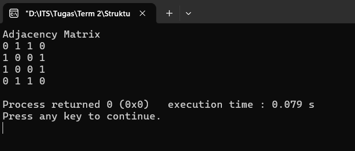
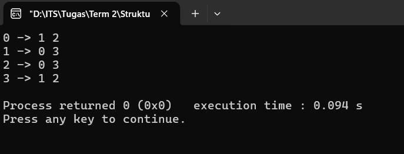
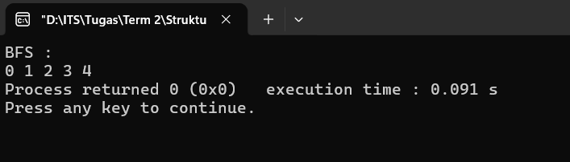
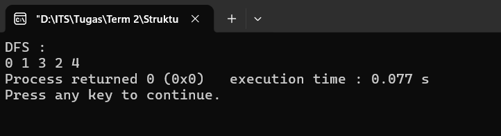
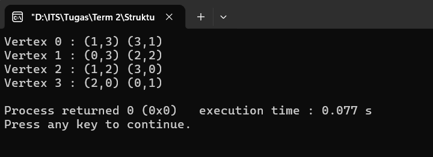
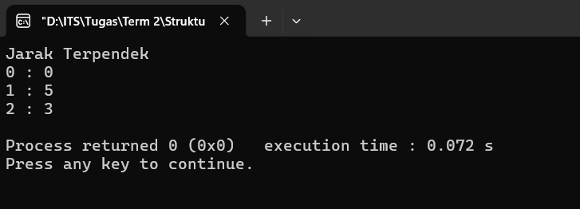
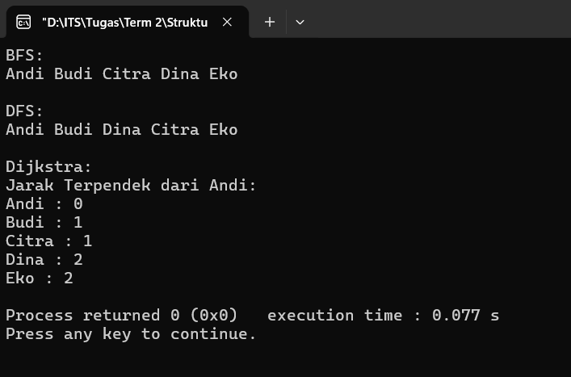

# Graf

## Adjacency Matrix
**Full Code**:
```cpp
#include <bits/stdc++.h>
using namespace std;

class Graph {
private:
    int matrix[100][100];
    int vertices;
public:
    Graph(int v){
        vertices = v;
        for(int i=0;i<v;i++){
            for(int j=0;j<v;j++) matrix[i][j]=0;
        }
    }

    void addEdge(int u,int v){
        matrix[u][v]=1;
        matrix[v][u]=1;
    }

    void display(){
        cout<<"Adjacency Matrix"<<endl;
        for(int i=0;i<vertices;i++){
            for(int j=0;j<vertices;j++) cout<<matrix[i][j]<<" ";

            cout<<endl;
        }
    }
};

int main(){
    Graph g(4);
    g.addEdge(0,1);
    g.addEdge(0,2);
    g.addEdge(1,3);
    g.addEdge(2,3);
    g.display();

    return 0;
}
```

### Penjelasan Kode
#### 1. ``

**Output**:



## Adjacency List
**Full Code**:
```cpp
#include <bits/stdc++.h>
using namespace std;

class Graph{
private:
    int V;
    vector<vector<int>> adj;
public:
    Graph(int vertices){
        V=vertices;
        adj.resize(V);
    }

    void addEdge(int u,int v){
        adj[u].push_back(v);
        adj[v].push_back(u);
    }

    void display(){
        for(int i=0;i<V;i++){
            cout<<i<<" -> ";
            for(int node : adj[i])cout<<node<<" ";
            cout<<endl;
        }
    }
};

int main(){
    Graph g(4);
    g.addEdge(0,1);
    g.addEdge(0,2);
    g.addEdge(1,3);
    g.addEdge(2,3);
    g.display();

    return 0;
}
```

### Penjelasan Kode
#### 1. ``

**Output**:



## BFS (Breadth-First Search)
**Full Code**:
```cpp
#include <bits/stdc++.h>
using namespace std;

class Graph{
private:
    int V;
    vector<vector<int>> adj;
public:
    Graph(int vertices){
        V=vertices;
        adj.resize(V);
    }

    void addEdge(int u,int v){
        adj[u].push_back(v);
        adj[v].push_back(u);
    }

    void BFS(int start){
        vector<bool> visited(V,false);
        queue<int> q;

        visited[start]=true;
        q.push(start);

        while(!q.empty()){
            int v=q.front();
            q.pop();
            cout<<v<<" ";

            for(int u : adj[v]){
                if(!visited[u]){
                    visited[u]=true;
                    q.push(u);
                }
            }
        }
    }
};

int main(){
    Graph g(5);
    g.addEdge(0,1);
    g.addEdge(0,2);
    g.addEdge(1,3);
    g.addEdge(2,4);

    cout<<"BFS : "<<endl;
    g.BFS(0);

    return 0;
}
```

### Penjelasan Kode
#### 1. ``

**Output**:



## DFS (Depth-First Search)
**Full Code**:
```cpp
#include <bits/stdc++.h>
using namespace std;

class Graph{
private:
    int V;
    vector<vector<int>> adj;
    vector<bool> visited;
public:
    Graph(int vertices){
        V=vertices;
        adj.resize(V);
        visited.resize(V,false);
    }

    void addEdge(int u,int v){
        adj[u].push_back(v);
        adj[v].push_back(u);
    }

    void DFS(int v){
        visited[v]=true;
        cout<<v<<" ";

        for(int u : adj[v]){
            if(!visited[u])DFS(u);
        }
    }
};

int main(){
    Graph g(5);
    g.addEdge(0,1);
    g.addEdge(0,2);
    g.addEdge(1,3);
    g.addEdge(2,4);

    cout<<"DFS : "<<endl;
    g.DFS(0);

    return 0;
}
```

### Penjelasan Kode
#### 1. ``

**Output**:



## Graf Berbobot
**Full Code**:
```cpp
#include <bits/stdc++.h>
using namespace std;

class Graph{
private:
    int V;
    vector<pair<int,int>> adj[100];
public:
    Graph(int vertices){
        V=vertices;
    }

    void addEdge(int u,int v,int weight){
        adj[u].push_back({v,weight});
        adj[v].push_back({u,weight});
    }

    void display(){
        for(int i=0;i<V;i++){
            cout<<"Vertex "<<i<<" : ";

            for(auto edge : adj[i])cout<<"("<<edge.first<<","<<edge.second<<") ";

            cout<<endl;
        }
    }
};

int main(){
    Graph g(4);
    g.addEdge(0,1,3);
    g.addEdge(1,2,2);
    g.addEdge(2,3,0);
    g.addEdge(3,0,1);

    g.display();

    return 0;
}
```

### Penjelasan Kode
#### 1. ``

**Output**:



## Dijkstra
**Full Code**:
```cpp
#include <bits/stdc++.h>
using namespace std;

const int INF = 1000000;
vector<pair<int,int>> graph[100];

void dijkstra(int start,int V){
    vector<int> dist(V,INF);
    priority_queue<
    pair<int,int>,
    vector<pair<int,int>>,
    greater<pair<int,int>>
    > pq;

    dist[start]=0;
    pq.push({0,start});

    while(!pq.empty()){
        int u=pq.top().second;
        pq.pop();

        for(auto edge : graph[u]){
            int v=edge.first;
            int w=edge.second;

            if(dist[v] > dist[u]+w){
                dist[v]=dist[u]+w;
                pq.push({dist[v],v});
            }
        }
    }

    cout<<"Jarak Terpendek"<<endl;

    for(int i=0;i<V;i++)cout<<i<<" : "<<dist[i]<<endl;
}

int main(){
    graph[0].push_back({1,5});
    graph[1].push_back({0,5});
    graph[0].push_back({2,3});
    graph[2].push_back({0,3});

    dijkstra(0, 3);

    return 0;
}
```

### Penjelasan Kode
#### 1. ``

**Output**:



## Studi Kasus: Pertemanan Media Sosial
**Full Code**:
```cpp
#include <bits/stdc++.h>
using namespace std;

const int INF = 1000000;
vector<pair<int,int>> graph[100];
vector<string> names={
    "Andi","Budi","Citra","Dina","Eko"
};

class Graph{
private:
    int V;
    vector<vector<int>> adj;
    vector<bool> visited;
public:
    Graph(int vertices){
        V=vertices;
        adj.resize(V);
        visited.resize(V,false);
    }

    void addEdge(int u,int v){
        adj[u].push_back(v);
        adj[v].push_back(u);
    }

    void BFS(int start){
        vector<bool> visited(V,false);
        queue<int> q;

        visited[start]=true;
        q.push(start);

        while(!q.empty()){
            int v=q.front();
            q.pop();
            cout<<names[v]<<" ";

            for(int u : adj[v]){
                if(!visited[u]){
                    visited[u]=true;
                    q.push(u);
                }
            }
        }
    }

    void DFS(int v){
        visited[v]=true;
        cout<<names[v]<<" ";

        for(int u : adj[v]){
            if(!visited[u])DFS(u);
        }
    }
};

void dijkstra(int start,int V){
    vector<int> dist(V,INF);
    priority_queue<
    pair<int,int>,
    vector<pair<int,int>>,
    greater<pair<int,int>>
    > pq;

    dist[start]=0;
    pq.push({0,start});

    while(!pq.empty()){
        int u=pq.top().second;
        pq.pop();

        for(auto edge : graph[u]){
            int v=edge.first;
            int w=edge.second;

            if(dist[v] > dist[u]+w){
                dist[v]=dist[u]+w;
                pq.push({dist[v],v});
            }
        }
    }

    cout<<"\nJarak Terpendek dari Andi:\n";

    for(int i=0;i<V;i++)cout<<names[i]<<" : "<<dist[i]<<endl;
}

int main(){
    Graph g(5);

    g.addEdge(0,1);
    g.addEdge(0,2);
    g.addEdge(1,3);
    g.addEdge(2,4);

    cout<<"BFS:\n";
    g.BFS(0);

    cout<<"\n\nDFS:\n";
    g.DFS(0);

    graph[0].push_back({1,1});
    graph[1].push_back({0,1});

    graph[0].push_back({2,1});
    graph[2].push_back({0,1});

    graph[1].push_back({3,1});
    graph[3].push_back({1,1});

    graph[2].push_back({4,1});
    graph[4].push_back({2,1});

    cout<<"\n\nDijkstra:";
    dijkstra(0,5);

    return 0;
}
```

### Penjelasan Kode
#### 1. ``

**Output**:


