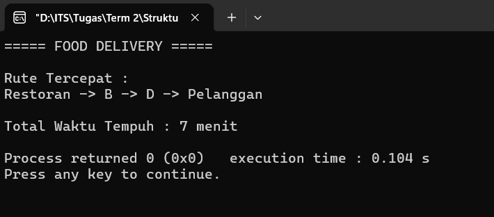

# Implementasi Algoritma Dijkstra

## Studi Kasus: _Food Delivery_
**Full Code**:
```cpp
#include <iostream>
#include <vector>
#include <queue>
#include <algorithm>
using namespace std;

const int INF = 1000000000;

int main() {
    vector<string> lokasi = {
        "Restoran",
        "A",
        "B",
        "C",
        "D",
        "E",
        "Pelanggan"
    };

    int n = 7;
    vector<pair<int,int>> graph[7];

    auto addEdge =
    [&](int u, int v, int w) {
        graph[u].push_back({v,w});
        graph[v].push_back({u,w});
    };

    addEdge(0,1,4);
    addEdge(0,2,2);
    addEdge(0,3,7);
    addEdge(1,2,3);
    addEdge(1,5,6);
    addEdge(2,3,3);
    addEdge(2,4,2);
    addEdge(2,5,3);
    addEdge(3,4,4);
    addEdge(4,6,3);
    addEdge(5,6,4);

    vector<int> dist(n, INF);
    vector<int> parent(n, -1);

    priority_queue<
    pair<int,int>,
    vector<pair<int,int>>,
    greater<pair<int,int>>
    > pq;

    int start = 0;
    int goal = 6;

    dist[start] = 0;
    pq.push({0,start});

    while(!pq.empty()) {
        int d = pq.top().first;
        int u = pq.top().second;
        pq.pop();

        if(d > dist[u]) continue;
        for(auto edge : graph[u]) {
            int v = edge.first;
            int w = edge.second;

            if(dist[u] + w < dist[v]) {
                dist[v] = dist[u] + w;
                parent[v] = u;
                pq.push({dist[v],v});
            }
        }
    }

    vector<int> path;
    for(int v = goal; v != -1; v = parent[v]) path.push_back(v);

    reverse(path.begin(), path.end());

    cout << "===== FOOD DELIVERY =====\n\n";
    cout << "Rute Tercepat : \n";

    for(int i=0;i<path.size();i++) {
        cout << lokasi[path[i]];

        if(i < path.size()-1) cout << " -> ";
    }

    cout << "\n\n";
    cout << "Total Waktu Tempuh : " << dist[goal] << " menit\n";

    return 0;
}
```

### Penjelasan Kode
Program ini merupakan simulasi sistem Food Delivery yang menggunakan algoritma Dijkstra untuk menentukan rute tercepat dari restoran menuju pelanggan. Lokasi-lokasi yang dilalui direpresentasikan sebagai _vertex_ dalam sebuah graf berbobot, sedangkan jalan yang menghubungkan lokasi tersebut direpresentasikan sebagai _edge_ yang memiliki bobot berupa waktu tempuh.

Graf pada program disimpan menggunakan struktur data _adjacency list_ berbobot yang terdapat pada variabel `graph`. Untuk mempermudah penambahan hubungan antar lokasi, digunakan fungsi lambda `addEdge()` yang berfungsi untuk menambahkan _edge_ beserta bobotnya ke dalam graf. Karena jalan dianggap dapat dilalui dua arah, setiap edge ditambahkan ke kedua _vertex_ yang saling terhubung.

Proses pencarian rute tercepat dilakukan menggunakan algoritma Dijkstra. Pada tahap awal, seluruh jarak dari lokasi awal ke lokasi lain diinisialisasi dengan nilai konstan yang sangat besar (`INF`), lalu disimpan pada _vector_ `dist`. Selain itu, _vector_ `parent` digunakan untuk menyimpan informasi _vertex_ sebelumnya pada jalur terpendek sehingga rute dapat direkonstruksi setelah proses pencarian selesai. Algoritma memanfaatkan _priority_queue_ untuk memilih _vertex_ yang memiliki jarak sementara paling kecil.

Selama algoritma berjalan, setiap _vertex_ yang diambil dari _priority queue_ akan memeriksa seluruh tetangganya. Jika ditemukan jalur yang menghasilkan jarak lebih pendek dibandingkan jarak yang telah disimpan sebelumnya, maka nilai pada _vector_ `dist` dan `parent` akan diperbarui. Proses ini terus dilakukan hingga seluruh kemungkinan jalur terpendek dari lokasi awal berhasil ditemukan.

Setelah algoritma selesai, program menyusun kembali rute tercepat dari pelanggan menuju restoran menggunakan informasi pada _vector_ `parent`. Jalur yang diperoleh kemudian dibalik menggunakan fungsi `reverse()` sehingga urutannya dimulai dari restoran menuju pelanggan. Terakhir, program menampilkan rute tercepat yang harus dilalui kurir beserta total waktu tempuh yang diperlukan.

Berdasarkan data graf yang digunakan, algoritma menghasilkan rute tercepat: Restoran → B → D → Pelanggan dengan total waktu tempuh 7 menit. Hasil tersebut menunjukkan bahwa algoritma Dijkstra mampu menemukan jalur pengantaran yang paling optimal sehingga dapat membantu meningkatkan efisiensi proses pengiriman makanan.

**Output**:


