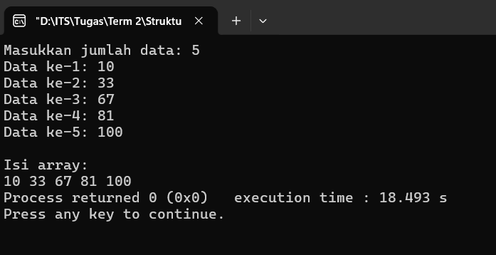
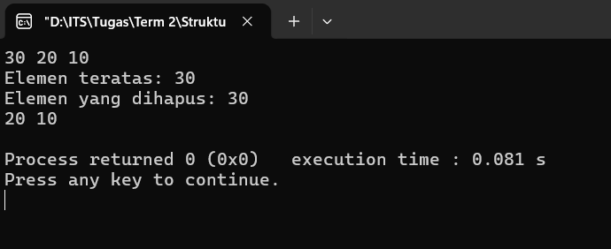
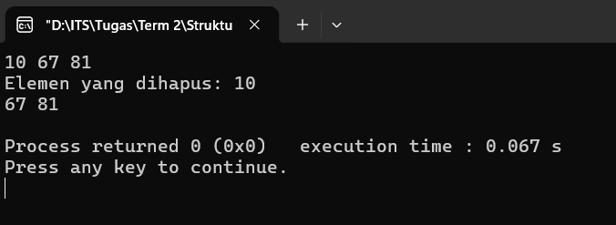
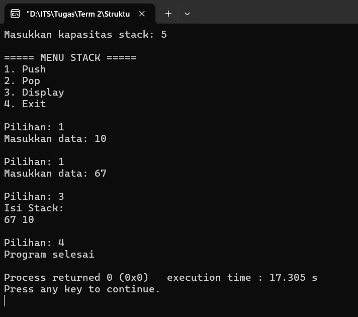
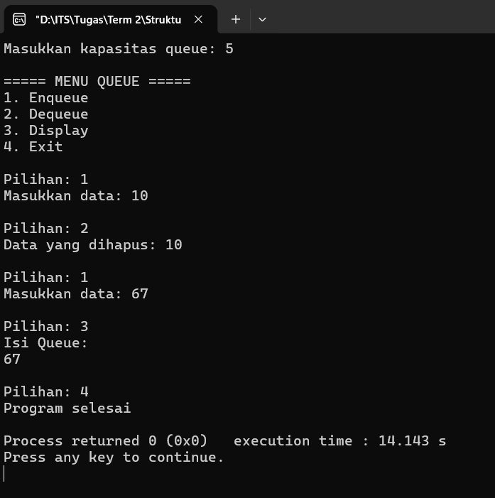
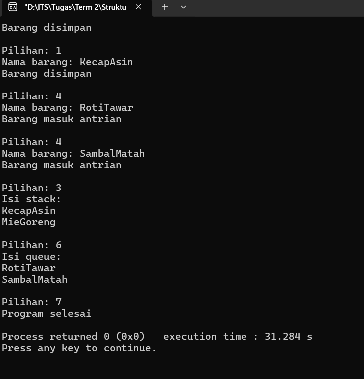
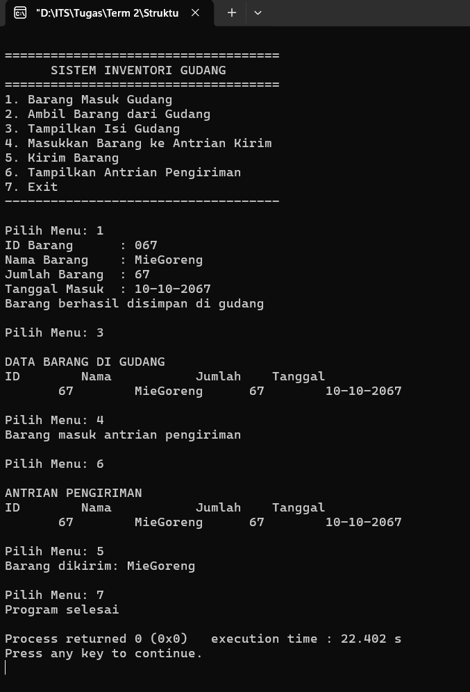

# Dynamic Array

## Implementasi Dynamic Array
**Full Code**:
```cpp
#include <bits/stdc++.h>
using namespace std;

int main() {
    int n;

    cout << "Masukkan jumlah data: ";
    cin >> n;

    int* data = new int[n];

    for(int i = 0; i < n; i++) {
        cout << "Data ke-" << i+1 << ": ";
        cin >> data[i];
    }

    cout << "\nIsi array:\n";
    for(int i = 0; i < n; i++) {
        cout << data[i] << " ";
    }

    delete[] data;

    return 0;
}
```

### Penjelasan Kode
#### 1. ``

**Output**:



## Implementasi Stack menggunakan Dynamic Array
**Full Code**:
```cpp
#include <bits/stdc++.h>
using namespace std;

class Stack {
private:
    int *arr;
    int top;
    int kapasitas;

public:
    Stack(int size) {
        kapasitas = size;
        arr = new int[kapasitas];
        top = -1;
    }

    void push(int x) {
        if (top == kapasitas - 1) {
            cout << "Stack Overflow\n";
            return;
        }
        arr[++top] = x;
    }

    void pop() {
        if (top == -1) {
            cout << "Stack Underflow\n";
            return;
        }
        cout << "Elemen yang dihapus: " << arr[top--] << endl;
    }

    void peek() {
        if (top == -1) {
            cout << "Stack kosong\n";
        } else {
            cout << "Elemen teratas: " << arr[top] << endl;
        }
    }

    void display() {
        if (top == -1) {
            cout << "Stack kosong\n";
            return;
        }
        for (int i = top; i >= 0; i--) {
            cout << arr[i] << " ";
        }
        cout << endl;
    }

    ~Stack() {
        delete[] arr;
    }
};

int main() {
    Stack s(5);

    s.push(10);
    s.push(20);
    s.push(30);

    s.display();
    s.peek();
    s.pop();
    s.display();

    return 0;
}
```

### Penjelasan Kode
#### 1. ``

**Output**:



## Implementasi Queue menggunakan Dynamic Array
**Full Code**:
```cpp
#include <bits/stdc++.h>
using namespace std;

class Queue {
private:
    int *arr;
    int front, rear;
    int kapasitas;

public:
    Queue(int size) {
        kapasitas = size;
        arr = new int[kapasitas];
        front = 0;
        rear = -1;
    }

    void enqueue(int x) {
        if (rear == kapasitas - 1) {
            cout << "Queue penuh\n";
            return;
        }
        arr[++rear] = x;
    }

    void dequeue() {
        if (front > rear) {
            cout << "Queue kosong\n";
            return;
        }
        cout << "Elemen yang dihapus: " << arr[front++] << endl;
    }

    void display() {
        if (front > rear) {
            cout << "Queue kosong\n";
            return;
        }
        for (int i = front; i <= rear; i++) {
            cout << arr[i] << " ";
        }
        cout << endl;
    }

    ~Queue() {
        delete[] arr;
    }
};

int main() {
    Queue q(5);

    q.enqueue(10);
    q.enqueue(67);
    q.enqueue(81);

    q.display();
    q.dequeue();
    q.display();

    return 0;
}
```

### Penjelasan Kode
#### 1. ``


**Output**:



## Program Stack (Menu Interaktif)
**Full Code**:
```cpp
#include <bits/stdc++.h>
using namespace std;

int main() {
    int kapasitas, pilihan, data;
    cout << "Masukkan kapasitas stack: ";
    cin >> kapasitas;

    int *stack = new int[kapasitas];
    int top = -1;

    cout << "\n===== MENU STACK =====\n";
    cout << "1. Push\n";
    cout << "2. Pop\n";
    cout << "3. Display\n";
    cout << "4. Exit\n";

    do {
        cout << "\nPilihan: ";
        cin >> pilihan;

        switch(pilihan) {
            case 1:
                if(top == kapasitas - 1) {
                    cout << "Stack Overflow\n";
                } else {
                    cout << "Masukkan data: ";
                    cin >> data;
                    stack[++top] = data;
                }
                break;

            case 2:
                if(top == -1) {
                    cout << "Stack kosong\n";
                } else {
                    cout << "Data yang dihapus: " << stack[top--] << endl;
                }
                break;

            case 3:
                if(top == -1) {
                    cout << "Stack kosong\n";
                } else {
                    cout << "Isi Stack:\n";
                    for(int i = top; i >= 0; i--) {
                        cout << stack[i] << " ";
                    }
                    cout << endl;
                }
                break;

            case 4:
                cout << "Program selesai\n";
                break;

            default:
                cout << "Pilihan tidak valid\n";
        }

    } while(pilihan != 4);

    delete[] stack;
    return 0;
}
```

### Penjelasan Kode
#### 1. ``

**Output**:



## Program Queue (Menu Interaktif)
**Full Code**:
```cpp
#include <bits/stdc++.h>
using namespace std;

int main() {
    int kapasitas, pilihan, data;
    cout << "Masukkan kapasitas queue: ";
    cin >> kapasitas;

    int *queue = new int[kapasitas];
    int front = 0;
    int rear = -1;

    cout << "\n===== MENU QUEUE =====\n";
    cout << "1. Enqueue\n";
    cout << "2. Dequeue\n";
    cout << "3. Display\n";
    cout << "4. Exit\n";

    do {

        cout << "\nPilihan: ";
        cin >> pilihan;

        switch(pilihan) {
            case 1:
                if(rear == kapasitas - 1) {
                    cout << "Queue penuh\n";
                } else {
                    cout << "Masukkan data: ";
                    cin >> data;
                    queue[++rear] = data;
                }
                break;

            case 2:
                if(front > rear) {
                    cout << "Queue kosong\n";
                } else {
                    cout << "Data yang dihapus: " << queue[front++] << endl;
                }
                break;

            case 3:
                if(front > rear) {
                    cout << "Queue kosong\n";
                } else {
                    cout << "Isi Queue:\n";
                    for(int i = front; i <= rear; i++) {
                        cout << queue[i] << " ";
                    }
                    cout << endl;
                }
                break;

            case 4:
                cout << "Program selesai\n";
                break;

            default:
                cout << "Pilihan tidak valid\n";
        }

    } while(pilihan != 4);

    delete[] queue;
    return 0;
}
```

### Penjelasan Kode
#### 1. ``

**Output**:



## Studi Kasus: Sistem Gudang Barang
**Full Code**:
```cpp
#include <bits/stdc++.h>
using namespace std;

int main() {

    int kapasitas = 10;
    string *stack = new string[kapasitas];
    string *queue = new string[kapasitas];

    int top = -1;
    int front = 0;
    int rear = -1;

    int pilihan;
    string barang;

    cout << "\n=== SISTEM GUDANG ===\n";
    cout << "1. Simpan Barang (Stack)\n";
    cout << "2. Ambil Barang (Stack)\n";
    cout << "3. Tampilkan Stack\n";
    cout << "4. Tambah Antrian Barang (Queue)\n";
    cout << "5. Ambil Barang dari Antrian (Queue)\n";
    cout << "6. Tampilkan Queue\n";
    cout << "7. Exit\n";

    do {
        cout << "\nPilihan: ";
        cin >> pilihan;

        switch(pilihan) {

        case 1:
            if(top == kapasitas-1) {
                cout << "Gudang stack penuh\n";
            } else {
                cout << "Nama barang: ";
                cin >> barang;
                stack[++top] = barang;
                cout << "Barang disimpan\n";
            }
            break;

        case 2:
            if(top == -1) {
                cout << "Stack kosong\n";
            } else {
                cout << "Barang diambil: " << stack[top--] << endl;
            }
            break;

        case 3:
            if(top == -1) {
                cout << "Stack kosong\n";
            } else {
                cout << "Isi stack:\n";
                for(int i = top; i >= 0; i--) {
                    cout << stack[i] << endl;
                }
            }
            break;

        case 4:
            if(rear == kapasitas-1) {
                cout << "Queue penuh\n";
            } else {
                cout << "Nama barang: ";
                cin >> barang;
                queue[++rear] = barang;
                cout << "Barang masuk antrian\n";
            }
            break;

        case 5:
            if(front > rear) {
                cout << "Queue kosong\n";
            } else {
                cout << "Barang keluar: " << queue[front++] << endl;
            }
            break;

        case 6:
            if(front > rear) {
                cout << "Queue kosong\n";
            } else {
                cout << "Isi queue:\n";
                for(int i = front; i <= rear; i++) {
                    cout << queue[i] << endl;
                }
            }
            break;

        case 7:
            cout << "Program selesai\n";
            break;

        default:
            cout << "Pilihan tidak valid\n";
        }

    } while(pilihan != 7);

    delete[] stack;
    delete[] queue;

    return 0;
}
```

### Penjelasan Kode
#### 1. ``

**Output**:



## Studi Kasus: Sistem Inventori Gudang
**Full Code**:
```cpp
#include <bits/stdc++.h>
using namespace std;

struct Barang {
    int id;
    string nama;
    int jumlah;
    string tanggal;
};

int main() {

    int kapasitas = 10;
    Barang *stack = new Barang[kapasitas];
    Barang *queue = new Barang[kapasitas];

    int top = -1;
    int front = 0;
    int rear = -1;

    int pilihan;

    cout << "\n====================================\n";
    cout << "      SISTEM INVENTORI GUDANG\n";
    cout << "====================================\n";
    cout << "1. Barang Masuk Gudang\n";
    cout << "2. Ambil Barang dari Gudang\n";
    cout << "3. Tampilkan Isi Gudang\n";
    cout << "4. Masukkan Barang ke Antrian Kirim\n";
    cout << "5. Kirim Barang\n";
    cout << "6. Tampilkan Antrian Pengiriman\n";
    cout << "7. Exit\n";
    cout << "------------------------------------\n";

    do {
        cout << "\nPilih Menu: ";
        cin >> pilihan;

        switch(pilihan) {

        case 1:
            if(top == kapasitas-1) {
                cout << "Gudang penuh!\n";
            } else {
                Barang b;

                cout << "ID Barang      : ";
                cin >> b.id;
                cout << "Nama Barang    : ";
                cin >> b.nama;
                cout << "Jumlah Barang  : ";
                cin >> b.jumlah;
                cout << "Tanggal Masuk  : ";
                cin >> b.tanggal;

                stack[++top] = b;

                cout << "Barang berhasil disimpan di gudang\n";
            }
            break;

        case 2:
            if(top == -1) {
                cout << "Gudang kosong\n";
            } else {
                cout << "Barang diambil: " << stack[top].nama << endl;
                top--;
            }
            break;

        case 3:
            if(top == -1) {
                cout << "Gudang kosong\n";
            } else {

                cout << "\nDATA BARANG DI GUDANG\n";
                cout << left << setw(10) << "ID"
                     << setw(15) << "Nama"
                     << setw(10) << "Jumlah"
                     << setw(15) << "Tanggal\n";

                for(int i = top; i >= 0; i--) {
                    cout << setw(10) << stack[i].id
                         << setw(15) << stack[i].nama
                         << setw(10) << stack[i].jumlah
                         << setw(15) << stack[i].tanggal << endl;
                }
            }
            break;

        case 4:
            if(top == -1) {
                cout << "Tidak ada barang di gudang\n";
            }
            else if(rear == kapasitas-1) {
                cout << "Antrian penuh\n";
            }
            else {
                queue[++rear] = stack[top--];
                cout << "Barang masuk antrian pengiriman\n";
            }
            break;

        case 5:
            if(front > rear) {
                cout << "Tidak ada barang dalam antrian\n";
            } else {
                cout << "Barang dikirim: " << queue[front].nama << endl;
                front++;
            }
            break;

        case 6:
            if(front > rear) {
                cout << "Antrian kosong\n";
            } else {

                cout << "\nANTRIAN PENGIRIMAN\n";

                cout << left << setw(10) << "ID"
                     << setw(15) << "Nama"
                     << setw(10) << "Jumlah"
                     << setw(15) << "Tanggal\n";

                for(int i = front; i <= rear; i++) {
                    cout << setw(10) << queue[i].id
                         << setw(15) << queue[i].nama
                         << setw(10) << queue[i].jumlah
                         << setw(15) << queue[i].tanggal << endl;
                }
            }
            break;

        case 7:
            cout << "Program selesai\n";
            break;

        default:
            cout << "Pilihan tidak tersedia\n";
        }

    } while(pilihan != 7);

    delete[] stack;
    delete[] queue;

    return 0;
}
```

### Penjelasan Kode
#### 1. ``

**Output**:


