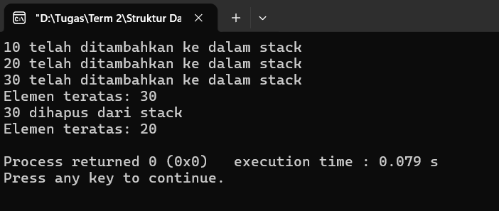
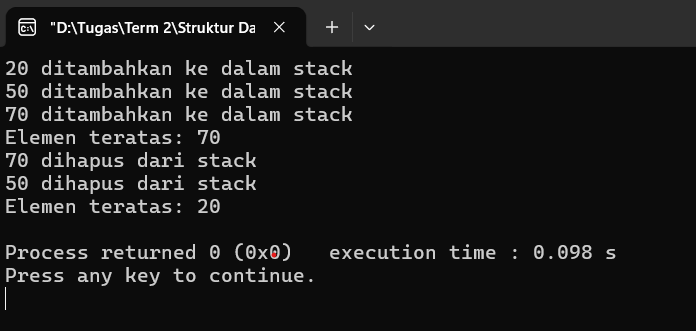

# Stack di C++

## Stack dengan Array
Program ini mengimplementasikan struktur data stack menggunakan array statis dengan kapasitas maksimal lima elemen. Di dalam program ini, array digunakan untuk menyimpan elemen stack, dan variabel `top` sebagai indeks yang menunjukkan posisi elemen teratas. Variabel `top` tersebut akan diinisialisasi dengan nilai -1, untuk menandakan bahwa stack masih kosong.

### Operasi Stack:
#### Push
```cpp
void push(int x) {
    if (top == MAX - 1) cout << "Stack overflow\n";
    else {
        arr[++top] = x;
        cout << x << " telah ditambahkan ke dalam stack\n";
    }
}
```
Variabel `top` akan dicek terlebih dahulu. Jika `top == 4`, maka stack sudah penuh. Jika belum, maka variabel `top` akan di-*increment* terlebih dahulu, baru setelahnya diisi dengan nilai x.

#### Pop
```cpp
void pop() {
    if(top == -1) cout << "Stack underflow\n";
    else {
        cout << arr[top--] << " dihapus dari stack\n";
    }
}
```
Variabel `top` akan dicek terlebih dahulu. Jika `top == -1`, maka stack sudah kosong. Jika belum, maka nilai teratas diambil terlebih dahulu dan variabel `top` akan di-*decrement*.

#### Peek
```cpp
void peek() {
    if (top == -1) cout << "Stack kosong\n";
    else cout << "Elemen teratas: " << arr[top] << endl;
}
```
Variabel `top` akan dicek terlebih dahulu. Jika `top == -1`, maka stack sudah kosong. Jika belum, maka nilai teratas akan ditampilkan tanpa menghapusnya.

Untuk mengeksekusi program, fungsi-fungsi operasi stack yang telah dibuat dapat dipanggil di dalam fungsi utama.

**Full Code**:
```cpp
#include <bits/stdc++.h>
using namespace std;

#define MAX 5

class stack_ {
private:
    int arr[MAX];
    int top;

public:
    stack_() {
        top = -1; // stack kosong
    }

    // push
    void push(int x) {
        if (top == MAX - 1) cout << "Stack overflow\n";
        else {
            arr[++top] = x;
            cout << x << " telah ditambahkan ke dalam stack\n";
        }
    }

    // pop
    void pop() {
        if(top == -1) cout << "Stack underflow\n";
        else {
            cout << arr[top--] << " dihapus dari stack\n";
        }
    }

    // top/peek
    void peek() {
        if (top == -1) cout << "Stack kosong\n";
        else cout << "Elemen teratas: " << arr[top] << endl;
    }
};

int main() {
    stack_ s;

    s.push(10);
    s.push(20);
    s.push(30);

    s.peek();

    s.pop();
    s.peek();

    return 0;
}
```

**Output**:



## Stack dengan Link List
Program ini mengimplementasikan struktur data stack menggunakan linked list yang bersifat dinamis (tidak terbatas). Di dalam program ini, variabel `data` digunakan untuk menyimpan nilai integer, dan variabel `next` merupakan pointer yang ke node berikutnya. Lalu, variabel `top` digunakan sebagai pointer ke elemen teratas.

### Operasi Stack:
#### Push
```cpp
void push(int x) {
    node *new_node = new node();
    new_node->data = x;
    new_node->next = top;
    top = new_node;

    cout << x << " ditambahkan ke dalam stack\n";
}
```
Untuk menambah elemen, maka akan dibuat node baru terlebih dahulu menggunakan operator `new`. Setelah itu, variabel `data` akan diisi dengan nilai x dan node baru akan menunjuk ke top yang lama. Di akhir, top akan menunjuk ke node baru.

#### Pop
```cpp
void pop() {
    if (top == NULL) {
        cout << "Stack underflow\n";
        return;
    }

    node *temp = top;
    cout << temp->data << " dihapus dari stack\n";
    top = top->next;
    delete temp;
}
```
Variabel `top` akan dicek terlebih dahulu. Jika `top == NULL`, maka stack sudah kosong dan akan langsung `return`. Jika belum, maka node teratas akan disimpan terlebih dahulu ke variabel `temp`. Setelah itu, `top` akan dipindahkan ke node berikutnya, dan node lama dihapus (bebaskan memori).

#### Peek
```cpp
void peek() {
    if (top == NULL) cout << "Stack kosong\n";
    else cout << "Elemen teratas: " << top->data << endl;
}
```
Variabel `top` akan dicek terlebih dahulu. Jika `top == NULL`, maka stack sudah kosong. Jika belum, maka nilai teratas akan langsung ditampilkan tanpa menghapusnya.

Sama seperti sebelumnya, untuk mengeksekusi program, fungsi-fungsi operasi stack yang telah dibuat dapat dipanggil di fungsi utama.

**Full Code**:
```cpp
#include <bits/stdc++.h>
using namespace std;

// struktur node
struct node {
    int data;
    node *next;
};

class stack_ {
private:
    node *top;

public:
    // konstruktor
    stack_() {
        top = NULL;
    }

    // push
    void push(int x) {
        node *new_node = new node();
        new_node->data = x;
        new_node->next = top;
        top = new_node;

        cout << x << " ditambahkan ke dalam stack\n";
    }

    // pop
    void pop() {
        if (top == NULL) {
            cout << "Stack underflow\n";
            return;
        }

        node *temp = top;
        cout << temp->data << " dihapus dari stack\n";
        top = top->next;
        delete temp;
    }

    // top/peek
    void peek() {
        if (top == NULL) cout << "Stack kosong\n";
        else cout << "Elemen teratas: " << top->data << endl;
    }

    // cek_kosong
    bool check_empty() {
        return (top == NULL);
    }
};

int main() {
    stack_ s;

    s.push(20);
    s.push(50);
    s.push(70);

    s.peek();

    s.pop();
    s.pop();
    s.peek();

    return 0;
}
```

**Output***:


