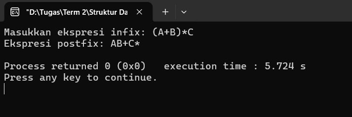
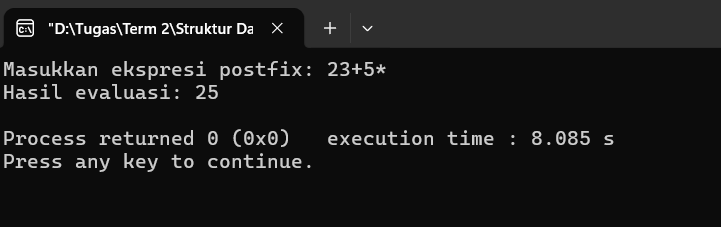

# Studi Kasus Stack

## Konversi ke Postfix

**Full Code**:
```cpp
#include <bits/stdc++.h>
using namespace std;

int precedence(char opr) {
    if(opr == '^') return 3;
    else if(opr == '*' || opr == '/') return 2;
    else if(opr == '+' || opr == '-') return 1;
    else return 0;
}

bool is_operator(char c) {
    return(c == '^' || c == '*' || c == '/' || c == '+' || c == '-');
}

string infix_to_postfix(string infix) {
    stack<char> st;
    string postfix = "";

    for(int i = 0; i < infix.length(); i++) {
        char c = infix[i];

        if(isalnum(c)) postfix += c;
        else if(c == '(') st.push(c);
        else if(c == ')') {
            while(!st.empty() && st.top() != '(') {
                postfix += st.top();
                st.pop();
            }

            if(!st.empty()) st.pop();
        }
        else if(is_operator(c)) {
            while(!st.empty() && precedence(st.top()) >= precedence(c)) {
                postfix += st.top();
                st.pop();
            }

            st.push(c);
        }
    }

    while(!st.empty()) {
        postfix += st.top();
        st.pop();
    }

    return postfix;
}

int main() {
    string infix;

    cout << "Masukkan ekspresi infix: ";
    cin >> infix;

    string postfix = infix_to_postfix(infix);

    cout << "Ekspresi postfix: " << postfix << endl;

    return 0;
}
```

### Penjelasan Fungsi
#### 1. `precedence(char opr)`
Fungsi tersebut digunakan untuk menentukan tingkat prioritas operator, yang di mana operator `^` (pangkat) merupakan operator dengan tingkat prioritas tertinggi, dan operator `+` dan `-` merupakan operator dengan tingkat prioritas terendah.

#### 2. `is_operator(char c)`
Fungsi tersebut digunakan untuk memeriksa apakah karakter tersebut merupakan operator (`^ * / + -`).

#### 3. `infix_to_postfix(string infix)`
Fungsi tersebut merupakan fungsi utama yang digunakan untuk mengubah ekspresi matematika dari bentuk infix menjadi postfix. Pada fungsi tersebut, terdapat aturan yang digunakan untuk mengubah ekspresi matematika infix menjadi postfix, yakni:
1. Operand(huruf/angka): langsung ditambah ke *output*
2. `(`: push ke stack
3. `)`: pop semua operator sampai menemukan `)`, lalu buang `(`
4. Operator: pop operator dengan prioritas >= operator saat ini, lalu push ke operator terbaru

**Output**:



### Visualisasi Output
| Read | Action | Stack | Output |
|------|--------|-------|--------|
| `(` | Push ke stack | `(` |
| `A` | Tambahkan ke *output* | `(` | `A` |
| `+` | Push ke stack | `(+` | `A` |
| `B` | Tambahkan ke *output* | `(+` | `AB` |
| `)` | Pop operator di stack sampai `(`|| `AB+` |
| `*` | Push ke stack | `*` | `AB+` |
| `C` | Tambahkan ke *output* | `*` | `AB+C` |
| (end) | Pop semua isi stack || `AB+C*` |

## Evaluasi Postfix

**Full Code**:
```cpp
#include <bits/stdc++.h>
using namespace std;

int eval_postfix(string exp) {
    stack<int> st;

    for(char c : exp) {

        if(isdigit(c)) st.push(c - '0');
        else {
            int num2 = st.top();
            st.pop();
            int num1 = st.top();
            st.pop();

            switch(c) {
                case '*': st.push(num1 * num2); break;
                case '/': st.push(num1 / num2); break;
                case '+': st.push(num1 + num2); break;
                case '-': st.push(num1 - num2); break;
            }
        }
    }

    return st.top();
}

int main() {
    string postfix;

    cout << "Masukkan ekspresi postfix: ";
    cin >> postfix;

    cout << "Hasil evaluasi: " << eval_postfix(postfix) << endl;

    return 0;
}
```

### Penjelasan Kode
Proses evaluasi ekspresi matematika postfix diproses di dalam fungsi `eval_postfix(string exp)`. Di dalam fungsi tersebut, stack digunakan untuk menyimpan operand/angka. Apabila ditemukan sebuah operator, maka dua operand/angka terbaru yang ada di dalam stack akan dimasukkan ke dalam variabel `num2` dan `num1`. Setelahnya, kedua variabel tersebut akan dioperasikan menyesuaikan operator yang ditemukan.

**Output**:



### Visualisasi Output
| Read | Action | Stack |
|------|--------|-------|
| `2` | Push ke stack | `2` |
| `3` | Push ke stack | `2, 3` |
| `+` | Pop 3 (`num2`) dan pop 2 (`num1`); push 3 + 2 = 5 | `5` |
| `5` | Push ke stack | `5, 5` |
| `*` | Pop 5 (`num2`) dan pop 5 (`num1`); push 5 * 5 = 25 | `25` |
