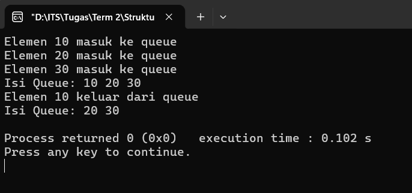
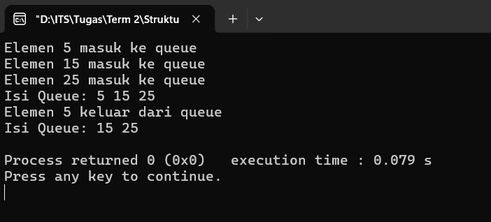

# Queue

## Implementasi _Queue_ dengan _Array_

**Full Code**:
```cpp
#include <iostream>
using namespace std;

#define MAX 5

class Queue {
private:
    int arr[MAX];
    int front, rear;

public:
    Queue() {
        front = -1;
        rear = -1;
    }

    bool isEmpty() {
        return(front == -1);
    }

    bool isFull() {
        return(rear == MAX - 1);
    }

    void enqueue(int x) {
        if (isFull()) {
            cout << "Queue Overflow\n";
            return;
        }

        if (isEmpty()) front = 0;

        arr[++rear] = x;
        cout << "Elemen " << x << " masuk ke queue\n";
    }

    void dequeue() {
        if (isEmpty()) {
            cout << "Queue Underflow\n";
            return;
        }

        cout << "Elemen " << arr[front] << " keluar dari queue\n";

        if (front == rear) front = rear = -1;
        else front++;
    }

    void display() {
        if (isEmpty()) {
            cout << "Queue kosong\n";
            return;
        }

        cout << "Isi Queue: ";

        for (int i = front; i <= rear; i++) cout << arr[i] << " ";

        cout << endl;
    }
};

int main() {
    Queue q;

    q.enqueue(10);
    q.enqueue(20);
    q.enqueue(30);

    q.display();

    q.dequeue();
    q.display();

    return 0;
}

```

### Penjelasan Fungsi
#### 1. ``


**Output**:



## Implementasi _Queue_ dengan _Linked List_

**Full Code**:
```cpp
#include <iostream>
using namespace std;

struct Node {
    int data;
    Node* next;
};

class Queue {
private:
    Node *front, *rear;

public:
    Queue() {
        front = rear = NULL;
    }

    bool isEmpty() {
        return (front == NULL);
    }

    void enqueue(int x) {
        Node* newNode = new Node();
        newNode->data = x;
        newNode->next = NULL;

        if (rear == NULL) front = rear = newNode;
        else {
            rear->next = newNode;
            rear = newNode;
        }

        cout << "Elemen " << x << " masuk ke queue\n";
    }

    void dequeue() {
        if (isEmpty()) {
            cout << "Queue kosong\n";
            return;
        }

        Node* temp = front;
        cout << "Elemen " << temp->data << " keluar dari queue\n";

        front = front->next;

        if (front == NULL) rear = NULL;

        delete temp;
    }

    void display() {
        if (isEmpty()) {
            cout << "Queue kosong\n";
            return;
        }

        Node* temp = front;
        cout << "Isi Queue: ";

        while (temp != NULL) {
            cout << temp->data << " ";
            temp = temp->next;
        }

        cout << endl;
    }
};

int main() {
    Queue q;

    q.enqueue(5);
    q.enqueue(15);
    q.enqueue(25);

    q.display();

    q.dequeue();
    q.display();

    return 0;
}
```

### Penjelasan Fungsi
#### 1. ``

**Output**:


