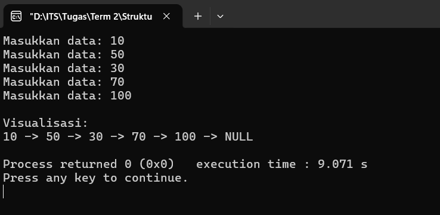
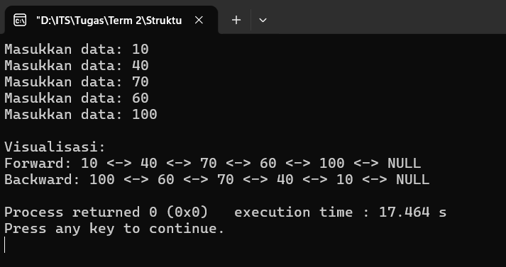
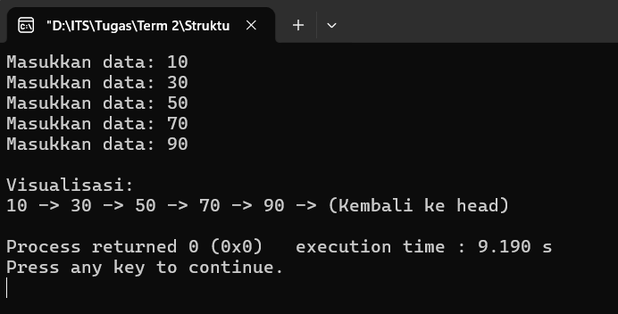

# Linked List

## Singly Linked List

**Full Code**:
```cpp
#include <bits/stdc++.h>
#define MAX 5
using namespace std;

struct Node {
    int data;
    Node *next;
};

Node *_insert(Node *node, int value) {
    Node *newNode = new Node();
    newNode->data = value;
    newNode->next = NULL;

    if(node == NULL) return newNode;

    Node *temp = node;

    while(temp->next != NULL) temp = temp->next;
    temp->next = newNode;

    return node;
}

void traversal(Node *node) {
    if(node == NULL) return;

    Node *temp = node;

    while(temp != NULL) {
        cout << temp->data << " -> ";
        temp = temp->next;
    }

    cout << "NULL" << endl;
}

int main() {
    Node *node = NULL;

    int iter = MAX;

    while(iter--) {
        int num;

        cout << "Masukkan data: ";
        cin >> num;

        node = _insert(node, num);
    }

    cout << endl << "Visualisasi:" << endl;
    traversal(node);

    return 0;
}
```

### Penjelasan Kode
Program tersebut akan menyimpan nilai yang di-_input_ oleh pengguna (total sebanyak 5 nilai) ke dalam struktur data _linked list_ dengan arah penelusuran satu arah. Pada bagian _struct_, terdapat variabel `data` yang digunakan untuk menyimpan nilai dari proses _input_ pengguna, dan _pointer_ `next` yang menunjuk ke _node_ berikutnya.

#### Penjelasan Fungsi
##### 1. `_insert(Node *node, int value)`
Fungsi tersebut digunakan untuk menambah _node_ baru di akhir _linked list_. _Node_ baru dibuat menggunakan `new Node()`, lalu mengisi `data` dengan `value` dan `next` dengan `NULL`. Lalu, _node_ terakhir akan dihubungkan dengan _node_ baru tersebut.

##### 2. `traversal(Node *node)`
Fungsi tersebut digunakan untuk menampilkan seluruh isi _linked list_. Mulai dari _node_ pertama, fungsi tersebut akan _looping_ untuk menampilkan seluruh isi _linked list_ sebelum mencapai `NULL`.

**Output**:



## Doubly Linked List

**Full Code**:
```cpp
#include <bits/stdc++.h>
#define MAX 5
using namespace std;

struct Node {
    int data;
    Node *next, *prev;
};

Node *_insert(Node *node, int value) {
    Node *newNode = new Node();
    newNode->data = value;
    newNode->next = NULL;
    newNode->prev = NULL;

    if(node == NULL) return newNode;

    Node *temp = node;

    while(temp->next != NULL) temp = temp->next;

    temp->next = newNode;
    newNode->prev = temp;

    return node;
}

void _next(Node *node) {
    Node *temp = node;

    while(temp != NULL) {
        cout << temp->data << " <-> ";
        temp = temp->next;
    }

    cout << "NULL" << endl;
}

void _prev(Node *node) {
    if(node == NULL) return;

    Node *temp = node;

    while(temp->next != NULL) temp = temp->next;

    while(temp != NULL) {
        cout << temp->data << " <-> ";
        temp = temp->prev;
    }

    cout << "NULL" << endl;
}

int main() {
    Node *node = NULL;

    int iter = MAX;

    while(iter--) {
        int num;

        cout << "Masukkan data: ";
        cin >> num;

        node = _insert(node, num);
    }

    cout << endl << "Visualisasi:" << endl;
    cout << "Forward: ";
    _next(node);

    cout << "Backward: ";
    _prev(node);

    return 0;
}
```

### Penjelasan Kode
Program tersebut akan menyimpan nilai yang di-_input_ oleh pengguna (total sebanyak 5 nilai) ke dalam struktur data _linked list_ dengan arah penelusuran dua arah. Pada bagian _struct_, terdapat variabel `data` yang digunakan untuk menyimpan nilai dari proses _input_ pengguna, serta _pointer_ `next` yang menunjuk ke _node_ berikutnya dan `prev` yang menunjuk ke _node_ sebelumnya.

#### Penjelasan Fungsi
##### 1. `_insert(Node *node, int value)`
Fungsi tersebut digunakan untuk menambah _node_ baru di akhir _linked list_. _Node_ baru dibuat menggunakan `new Node()`, lalu mengisi `data` dengan `value` serta `next` dan `prev` dengan `NULL`. Lalu, _node_ terakhir akan dihubungkan dengan _node_ baru tersebut. Selain itu, _node_ baru juga akan menunjuk ke _node_ sebelumnya, sehingga hubungan dua arah dapat terbentuk.

##### 2. `_next(Node *node)`
Fungsi tersebut digunakan untuk menampilkan seluruh isi _linked list_. Sama seperti fungsi `traversal` yang telah dijelaskan sebelumnya, dimulai dari _node_ pertama, fungsi tersebut akan _looping_ untuk menampilkan seluruh isi _linked list_ sebelum mencapai `NULL`.

##### 3. `_prev(Node *node)`
Fungsi tersebut digunakan untuk menampilkan seluruh isi _linked list_ secara terbalik (dari belakang). Mulai dari _node_ terakhir, fungsi tersebut akan _looping_ mundur untuk menampilkan seluruh isi _linked list_ hingga kembali ke _node_ pertama (sebelum mencapai `NULL`).

**Output**:



## Circular Linked List

**Full Code**:
```cpp
#include <bits/stdc++.h>
#define MAX 5
using namespace std;

struct Node {
    int data;
    Node *next;
};

Node *_insert(Node *node, int value) {
    Node *newNode = new Node();
    newNode->data = value;
    newNode->next = NULL;

    if(node == NULL) {
        newNode->next = newNode;
        return newNode;
    }

    Node *temp = node;

    while(temp->next != node) temp = temp->next;

    temp->next = newNode;
    newNode->next = node;

    return node;
}

void traversal(Node *node) {
    if(node == NULL) return;

    Node *temp = node;

    do {
        cout << temp->data << " -> ";
        temp = temp->next;
    } while(temp != node);

    cout << "(Kembali ke head)" << endl;
}

int main() {
    Node *node = NULL;

    int iter = MAX;

    while(iter--) {
        int num;

        cout << "Masukkan data: ";
        cin >> num;

        node = _insert(node, num);
    }

    cout << endl << "Visualisasi:" << endl;
    traversal(node);

    return 0;
}
```

### Penjelasan Kode
Program tersebut akan menyimpan nilai yang di-_input_ oleh pengguna (total sebanyak 5 nilai) ke dalam struktur data _linked list_ dengan arah penelusuran satu arah. Pada bagian _struct_, terdapat variabel `data` yang digunakan untuk menyimpan nilai dari proses _input_ pengguna, dan _pointer_ `next` yang menunjuk ke _node_ berikutnya.

#### Penjelasan Fungsi
##### 1. `_insert(Node *node, int value)`
Fungsi tersebut digunakan untuk menambah _node_ baru di akhir _linked list_. _Node_ baru dibuat menggunakan `new Node()`, lalu mengisi `data` dengan `value` dan `next` dengan `NULL`. Lalu, _node_ terakhir akan dihubungkan dengan _node_ baru tersebut, dan _node_ terbaru tersebut juga akan dihubungkan ke _node_ pertama, sehingga membentuk sebuah hubungan melingkar.

##### 2. `traversal(Node *node)`
Fungsi tersebut digunakan untuk menampilkan seluruh isi _linked list_. `do-while` digunakan agar setidaknya satu _node_ dicetak terlebih dahulu. Barulah selama kondisi `temp != node` (belum kembali ke awal), akan dilakukan _looping_ mulai dari _node_ pertama hingga sebelum mencapai `NULL` untuk menampilkan seluruh isi _linked list_.

**Output**:


